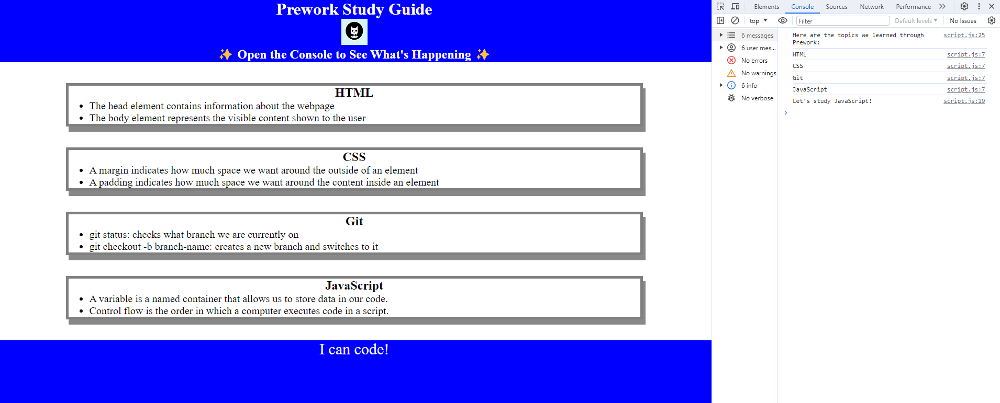

# <Study Guide Webpage>

## Description
This Study Guide was created for boot camp students who were going through the prework. It contains notes on HTML, CSS, git, and JavaScript.

## Installation
N/A

## Usage
To use this study guide, review the notes in each section. For suggestions on what to study, open the Chrome DevTools by pressing Command+Option+I (MacOS) or Control+Shift+I (Windows). A console panel should open either below or to the side of the webpage browser as shown in the image below. There you will see a list of topics we learned from Prework along with a suggestion on which topic to study.

## Credits

N/A

## License

Please refer to the LICENSE in the repo